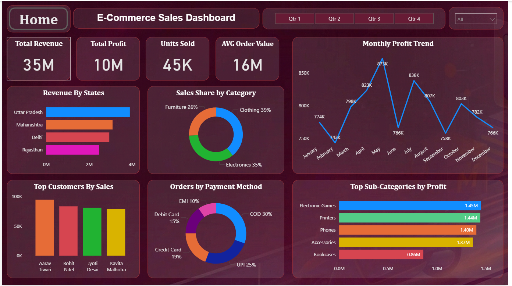

# E-Commerce Store Analysis (Power BI Project)

## 📊 Project Overview
This is my first Data Analytics project using Power BI.
The project analyzes E-commerce sales data and shows insights using dashboard.

## 🔧 Tools Used
- Power BI
- Excel
- Data Cleaning
- Data Visualization

## 📈 Dashboard Features
- Profit by Month
- Sales by Category
- Orders Analysis
- KPI Cards

## 📷 Dashboard Preview
]

## 👨‍💻 Author
Bhushan Khade
BSc Computer Science
Aspiring Data Analyst
